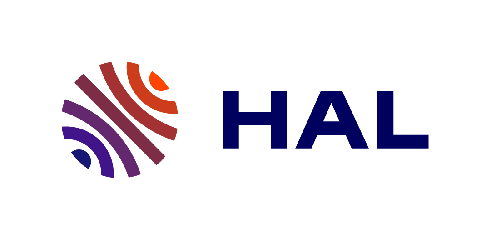

<!--[Link to another page](./another-page.html).-->

## Short bio
I'm an associate professor at University of Lille, with a particular interest in design, management and evolution of highly-configurable software systems. I'm member of the [Spirals](https://team.inria.fr/spirals/) group, a joint team between University of Lille within the [CRIStAL](https://www.cristal.univ-lille.fr/?lang=en) research center and [Inria](https://www.inria.fr/en/).

Before joining University of Lille, I was a postdoctoral fellow at Politecnico di Milano for 3 years, where I worked in the [DEEP-SE group](http://deepse.dei.polimi.it/).
I hold a MSc. in Computer Science from [University of Montpellier](https://www.umontpellier.fr/en/), and a PhD in Computer Science from University of Lille (2014). Prior to the PhD, I have been working for two years as a software engineer developing tools and apps for smartphones.

***

## Research Interests
* Software configuration, evolution and adaptation
* [Self-]Adaptive software systems, distributed systems
* [Dynamic] software product lines, feature-oriented software development
* Variability modeling, feature model analysis
* Model-driven engineering    

## Publications
<ul class="downloads">
  <li></li>
  <li></li>
  <li></li>
</ul>
***

## Supervised PhD students
*   Maxime Huyghe (2022-), *Automated software testing to improve the privacy of browsers*.
*   Tristan Coignon (2022-), *Emerging development paradigms to support cloud-based micro-services deployment*.
*   Alexandre Bonvoisin (2022-), *Frugal software architecture for deploying cloud native micro-services*.
*   Edouard Guégain (2020-), *Taming the complexity of fog environments*.
*   Zeinab Abou-Khalil (2017-2020), *Studying the evolution of the bug handling process in large open source ecosystems*.

***

## Contact
&emsp;
40 Avenue Halley, 59650 Villeneuve d'Ascq, France.

&emsp; <a href="mailto:clement.quinton@univ-lille.fr">clement.quinton@univ-lille.fr</a>

&emsp; +33 359 358 770
